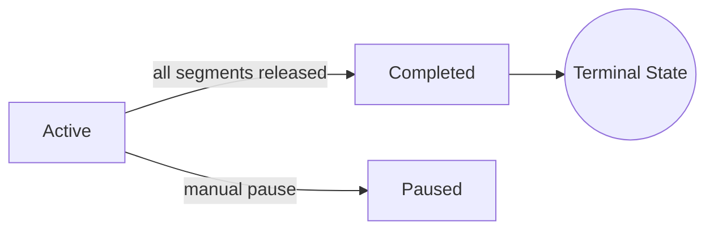

<div align="right">

**[简体中文](pipeline.zh-CN.md)** | **[English](pipeline.md)**

</div>

# Transform Pipeline & Hooks

InkDrip applies a series of content transforms to each segment at feed-serving time, then optionally delegates to external commands via the hook system. The pipeline lives in [`inkdrip-core/src/pipeline.rs`](/inkdrip-core/src/pipeline.rs); hooks in [`inkdrip-core/src/hooks.rs`](/inkdrip-core/src/hooks.rs).

## Built-in Transforms

Transforms run in a fixed order on every `serve_feed` request. Each transform receives a mutable `Segment` and a `TransformContext` (total segments, total words, base URL, feed slug, book ID).

| Order | Transform                  | Always On             | Description                                                            |
| ----- | -------------------------- | --------------------- | ---------------------------------------------------------------------- |
| 1     | `ImageUrlTransform`        | Yes                   | Rewrites `` to `{base_url}/images/{book_id}/{basename}` |
| 2     | `StyleTransform`           | If `custom_css` set   | Prepends `<style>` tag with user CSS                                   |
| 3     | `NavigationTransform`      | Yes                   | Appends prev/next links between segments                               |
| 4     | `ReadingProgressTransform` | If `reading_progress` | Appends `[42% · 12/28]` progress indicator                             |
| 5     | `ExternalCommandTransform` | If hooks enabled      | Delegates to external command via stdin/stdout                         |

### Configuration

```toml
[transforms]
reading_progress = true
custom_css = ""
```

## Hook System

Hooks run external commands at key pipeline stages, communicating via JSON on stdin/stdout. A misbehaving hook (non-zero exit, invalid JSON, timeout) never corrupts the pipeline — the original data is kept.

### Configuration

```toml
[hooks]
enabled = false
timeout_secs = 30

[hooks.post_book_parse]
enabled = true
command = "python3 /opt/inkdrip/hooks/post-parse.py"

[hooks.segment_transform]
enabled = true
command = "python3 /opt/inkdrip/hooks/transform.py"
```

### Available Hook Points

#### `post_book_parse`

**When:** After book parsing, before splitting into segments.

**Stdin:**
```json
{
  "hook": "post_book_parse",
  "title": "Book Title",
  "author": "Author Name",
  "chapters": [
    {"index": 0, "title": "Chapter 1", "content_html": "<p>...</p>", "word_count": 2500}
  ]
}
```

**Stdout** (or empty to keep original):
```json
{
  "chapters": [
    {"index": 0, "title": "Chapter 1 (fixed)", "content_html": "<p>...</p>", "word_count": 2500}
  ]
}
```

**Use cases:** correction, metadata enrichment, chapter reordering, content filtering.

#### `segment_transform`

**When:** During feed serving, after all internal transforms, before feed XML generation.

**Stdin:**
```json
{
  "hook": "segment_transform",
  "segment_index": 12,
  "title_context": "Chapter 3 (2/4)",
  "content_html": "<p>...</p>",
  "word_count": 1450,
  "cumulative_words": 12345,
  "feed_slug": "my-book",
  "base_url": "http://localhost:8080",
  "book_id": "abc123"
}
```

**Stdout** (or empty to keep original):
```json
{
  "content_html": "<p>Transformed content...</p>"
}
```

**Use cases:** AI summaries, custom formatting, translation, content filtering.

#### `on_release` (reserved)

Defined in configuration but not yet wired into the serving path. Intended for notification-style hooks (email, webhook) when segments are first released.

### Safety Guarantees

1. **Non-blocking:** Hook failure → log warning, continue with original data.
2. **Timeout:** Global `timeout_secs` (default 30s) per hook execution.
3. **No shell:** Commands are split on whitespace and executed directly — no shell injection risk.
4. **stderr:** Always logged at `debug` level for troubleshooting.
5. **Exit code:** 0 = success, non-zero = failure (original kept).

## Feed Status Machine



On each `serve_feed` request, if the feed is `Active` and all segments have been released (i.e., `total_released >= book.total_segments`), the status is automatically transitioned to `Completed`.

## Aggregate Feeds

Aggregate feeds combine multiple book feeds into a single unified RSS/Atom feed. They collect released segments from all member feeds (or all feeds when `include_all = true`) and merge them chronologically. Aggregates do **not** re-apply transforms — they use the already-transformed segments from individual feeds.
