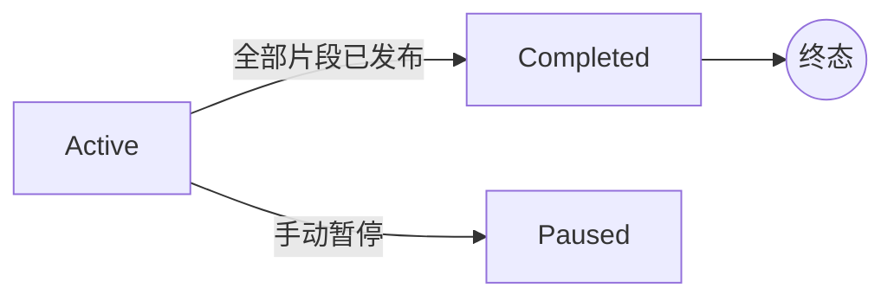

<div align="right">

**[简体中文](pipeline.zh-CN.md)** | **[English](pipeline.md)**

</div>

# 变换管线与钩子系统

InkDrip 在每次提供订阅源时对片段应用一系列内容变换，并可通过钩子系统委派给外部命令。管线实现位于 [`inkdrip-core/src/pipeline.rs`](/inkdrip-core/src/pipeline.rs)；钩子位于 [`inkdrip-core/src/hooks.rs`](/inkdrip-core/src/hooks.rs)。

## 内置变换

变换在每次 `serve_feed` 请求时按固定顺序执行。每个变换接收可变的 `Segment` 和 `TransformContext`（总片段数、总字数、基础 URL、订阅源标识、书籍 ID）。

| 顺序 | 变换                       | 常驻                       | 说明                                                                 |
| ---- | -------------------------- | -------------------------- | -------------------------------------------------------------------- |
| 1    | `ImageUrlTransform`        | 是                         | 将 `` 重写为 `{base_url}/images/{book_id}/{basename}` |
| 2    | `StyleTransform`           | 设置 `custom_css` 时       | 在内容前注入 `<style>` 标签                                          |
| 3    | `NavigationTransform`      | 是                         | 在片段尾部添加上/下一篇导航链接                                      |
| 4    | `ReadingProgressTransform` | 设置 `reading_progress` 时 | 附加 `[42% · 12/28]` 进度指示器                                      |
| 5    | `ExternalCommandTransform` | 启用钩子时                 | 通过 stdin/stdout 委派给外部命令                                     |

### 配置

```toml
[transforms]
reading_progress = true
custom_css = ""
```

## 钩子系统

钩子在管线的关键阶段运行外部命令，通过 stdin/stdout 交换 JSON。异常钩子（非零退出码、无效 JSON、超时）不会破坏管线——保留原始数据。

### 配置

```toml
[hooks]
enabled = false
timeout_secs = 30

[hooks.post_book_parse]
enabled = true
command = "python3 /opt/inkdrip/hooks/post-parse.py"

[hooks.segment_transform]
enabled = true
command = "python3 /opt/inkdrip/hooks/transform.py"
```

### 可用钩子点

#### `post_book_parse`

**时机**：书籍解析完成后，分段之前。

**stdin：**
```json
{
  "hook": "post_book_parse",
  "title": "书名",
  "author": "作者",
  "chapters": [
    {"index": 0, "title": "第一章", "content_html": "<p>...</p>", "word_count": 2500}
  ]
}
```

**stdout**（或为空以保留原始数据）：
```json
{
  "chapters": [
    {"index": 0, "title": "第一章（已修正）", "content_html": "<p>...</p>", "word_count": 2500}
  ]
}
```

**应用场景**：纠错、元数据补充、章节重排、内容过滤。

#### `segment_transform`

**时机**：订阅源提供时，所有内置变换完成后，生成 Feed XML 之前。

**stdin：**
```json
{
  "hook": "segment_transform",
  "segment_index": 12,
  "title_context": "第三章 (2/4)",
  "content_html": "<p>...</p>",
  "word_count": 1450,
  "cumulative_words": 12345,
  "feed_slug": "my-book",
  "base_url": "http://localhost:8080",
  "book_id": "abc123"
}
```

**stdout**（或为空以保留原始内容）：
```json
{
  "content_html": "<p>变换后的内容...</p>"
}
```

**应用场景**：AI 摘要、自定义格式化、翻译、内容过滤。

#### `on_release`（保留）

已在配置中定义但尚未接入提供路径。计划用于片段首次发布时的通知型钩子（邮件、Webhook）。

### 安全保证

1. **非阻塞**：钩子失败 → 记录警告，使用原始数据继续。
2. **超时**：全局 `timeout_secs`（默认 30 秒）限制每次钩子执行。
3. **无 Shell**：命令按空格分割后直接执行——无 Shell 注入风险。
4. **stderr**：始终以 `debug` 级别记录日志，便于排查。
5. **退出码**：0 = 成功，非零 = 失败（保留原始数据）。

## 订阅源状态机




每次 `serve_feed` 请求时，若订阅源状态为 `Active` 且所有片段已发布（即 `total_released >= book.total_segments`），状态自动转为 `Completed`。

## 聚合订阅源

聚合订阅源将多个书籍订阅源合并为单一 RSS/Atom 订阅源。收集所有成员订阅源（或 `include_all = true` 时的全部订阅源）的已发布片段，按时间顺序合并。聚合源**不会**重新应用变换——使用各订阅源已变换的片段。
